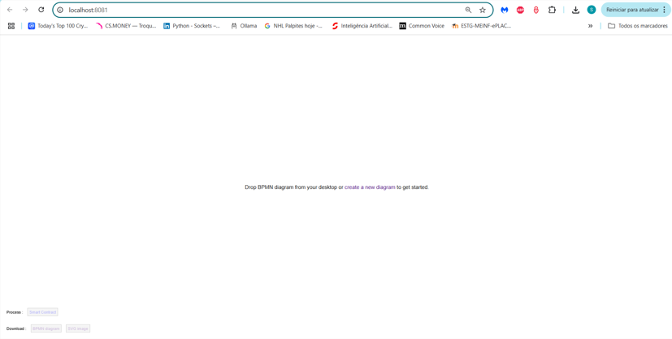
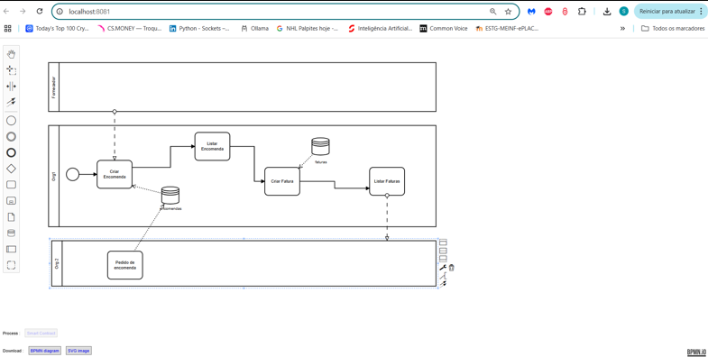
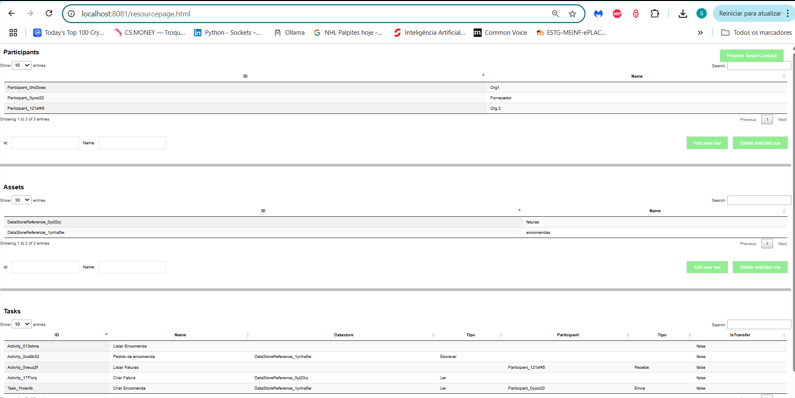
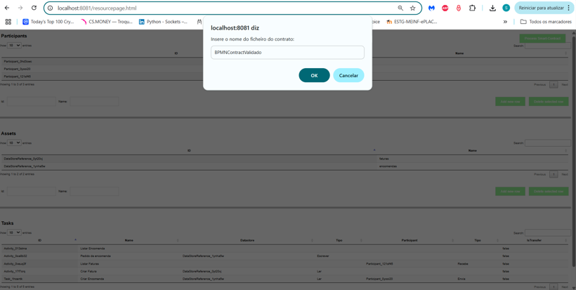
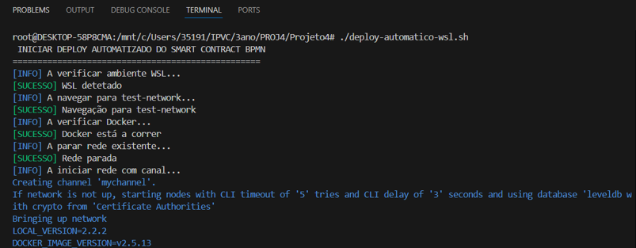
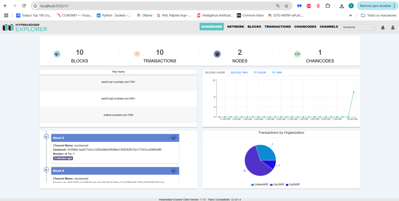

# Projeto BPMN to Hyperledger Fabric Smart Contract Generator

Este projeto permite gerar automaticamente smart contracts para Hyperledger Fabric a partir de diagramas BPMN. O sistema inclui um modelador BPMN visual, geração automática de código, deploy automático na rede Hyperledger Fabric e visualização através do Hyperledger Explorer.

## 🚀 Funcionalidades

- **Modelador BPMN Visual**: Interface web para criar e editar diagramas BPMN
- **Geração Automática de Smart Contracts**: Converte diagramas BPMN em código JavaScript para Hyperledger Fabric
- **Deploy Automático**: Script para criar e configurar automaticamente a rede Hyperledger Fabric
- **Visualização da Rede**: Interface web através do Hyperledger Explorer
- **Análise de Elementos BPMN**: Extração automática de participantes, datastores e tarefas


## 🛠️ Instalação

### 1. Clonar o repositório:
```bash
git clone https://github.com/joseribeiroipvc/Projeto4.git
cd Projeto4
```

### 2. Instalar dependências do projeto principal:
```bash
npm install
```

### 3. Instalar dependências do modelador:
```bash
cd modeler
npm install
cd ..
```

### 4. Instalar dependências do Smart Contract:
```bash
cd SmartContractHyperledger
npm install
cd ..
```

### 5. Dar permissões ao script de deploy:
```bash
chmod +x deploy-automatico-wsl.sh
```

## ⚙️ Configuração

### 1. Configurar variáveis de ambiente (se necessário):
```bash
# Criar ficheiro .env na raiz do projeto
touch .env
```

### 2. Verificar se o Docker está a correr:
```bash
docker ps
```

## 🚀 Execução do Projeto

### Passo 1: Iniciar o servidor backend
```bash
# Na raiz do projeto
node server.js
```

### Passo 2: Iniciar o modelador BPMN
```bash
# Num novo terminal, ir para o diretório modeler
cd modeler
npm run dev
```



### Passo 3: Aceder à interface web
Abra o navegador e aceda a: `http://localhost:8081`

**Na página inicial pode:**
- Arrastar um ficheiro `.bpmn` para a área de drop
- Criar um novo diagrama clicando em "create a new diagram"
- Visualizar e editar o diagrama BPMN



### Passo 4: Processar o BPMN
1. Após carregar/criar o diagrama BPMN
2. Clique no botão **Smart Contract** no canto superior direito
3. Será redirecionado para `resourcepage.html`

### Passo 5: Visualizar elementos BPMN
Na página `resourcepage.html` verá:
- **Participantes**: Tabela com participantes do processo
- **Assets**: Tabela com datastores/assets
- **Tarefas**: Tabela com todas as tarefas e as suas associações



### Passo 6: Gerar Smart Contract
1. Clique no botão **Process Smart-Contract**
2. Será solicitado o nome do ficheiro (ex: `MeuContrato`)
3. O ficheiro será gerado automaticamente no diretório `SmartContractHyperledger/`



### Passo 7: Configurar o Smart Contract
1. Edite o ficheiro `SmartContractHyperledger/index.js`
2. Certifique-se de que o nome do contrato está correto:
```javascript
const contract = require('./MeuContrato.js');
module.exports.contracts = [contract];
```

### Passo 8: Deploy da rede Hyperledger Fabric
```bash
# Na raiz do projeto
./deploy-automatico-wsl.sh
```



**Este script irá:**
- Criar a rede de teste com 2 organizações
- Empacotar o chaincode
- Instalar o chaincode nos peers
- Fazer deploy na rede
- Configurar o canal `mychannel`

### Passo 9: Configurar Hyperledger Explorer
```bash
# Criar container do Explorer
cd fabric-samples/explorer
docker-compose up -d
```

### Passo 10: Aceder ao Hyperledger Explorer
Abra o navegador e aceda a: `http://localhost:8080`

**No Explorer pode:**
- Visualizar blocos da blockchain
- Ver transações
- Monitorizar chaincode
- Visualizar organizações e peers




## 📁 Estrutura do Projeto

```
Projeto4/
├── README.md
├── server.js                          # Servidor backend
├── package.json                       # Dependências principais
├── deploy-automatico-wsl.sh           # Script de deploy automático
├── modeler/                           # Modelador BPMN
│   ├── app/
│   │   ├── index.html                 # Página principal do modelador
│   │   ├── resourcepage.html          # Página de visualização
│   │   ├── app.js                     # Lógica do modelador
│   │   └── process.js                 # Processamento BPMN
│   └── package.json
├── SmartContractHyperledger/           # Smart Contracts
│   ├── index.js                       # Configuração do chaincode
│   ├── contract.js                    # Smart contract gerado
│  
└── fabric-samples/                    # Rede Hyperledger Fabric
    ├── test-network/                  # Configuração da rede
    └── explorer/                      # Hyperledger Explorer
```


## 📊 Teste do Sistema

### 1. Teste básico do Smart Contract:
```bash
# Entrar no container CLI
docker exec -it cli bash

# Configurar variáveis de ambiente
export CORE_PEER_TLS_ENABLED=true
export CORE_PEER_LOCALMSPID=Org1MSP
export CORE_PEER_TLS_ROOTCERT_FILE=/opt/gopath/src/github.com/hyperledger/fabric/peer/organizations/peerOrganizations/org1.example.com/peers/peer0.org1.example.com/tls/ca.crt
export CORE_PEER_MSPCONFIGPATH=/opt/gopath/src/github.com/hyperledger/fabric/peer/organizations/peerOrganizations/org1.example.com/users/Admin@org1.example.com/msp
export CORE_PEER_ADDRESS=peer0.org1.example.com:7051

# Testar funções
peer chaincode invoke -o orderer.example.com:7050 --tls --cafile /opt/gopath/src/github.com/hyperledger/fabric/peer/organizations/ordererOrganizations/example.com/orderers/orderer.example.com/msp/tlscacerts/tlsca.example.com-cert.pem -C mychannel -n bpmn-contract --peerAddresses peer0.org1.example.com:7051 --tlsRootCertFiles /opt/gopath/src/github.com/hyperledger/fabric/peer/organizations/peerOrganizations/org1.example.com/peers/peer0.org1.example.com/tls/ca.crt --peerAddresses peer0.org2.example.com:9051 --tlsRootCertFiles /opt/gopath/src/github.com/hyperledger/fabric/peer/organizations/peerOrganizations/org2.example.com/peers/peer0.org2.example.com/tls/ca.crt -c '{"function":"InitLedger","Args":[]}'
```

### 2. Consultar dados:
```bash
peer chaincode query -C mychannel -n bpmn-contract -c '{"function":"getAllParticipants","Args":[]}'
```


## 📞 Suporte

Para suporte e dúvidas:
- Email: [samuelgomes@ipvc.pt]; [jose.ribeiro@ipvc.pt]
- Issues: [GitHub Issues](https://github.com/joseribeiroipvc/Projeto4/issues)

## 🎯 Roadmap
- [ ] Suporte para elementos BPMN mais complexos
- [ ] Interface web para configuração de rede
- [ ] Geração automática de testes
- [ ] Suporte para múltiplas linguagens de smart contract
- [ ] Integração com CI/CD
